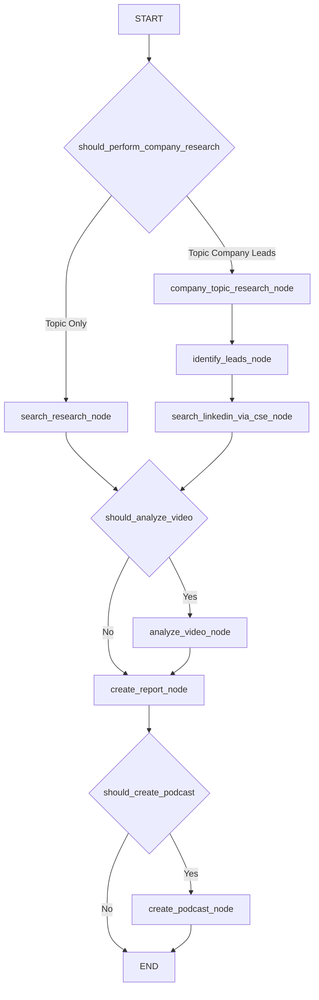

# Multi-Modal Researcher

This project is a versatile research and podcast generation workflow using LangGraph and Google's Gemini models. It now supports two main research approaches:
1.  **Topic-Only Research**: Performs web research on a given topic, optionally analyzes a YouTube video, synthesizes insights into a report, and can generate a podcast.
2.  **Topic, Company, and Leads Research**: Extends topic research to a specific company context. This approach first identifies potential **B2B sales opportunities** (or projects/needs) within the company related to the topic. For each opportunity, it then identifies relevant human **contact points** and potential **decision-makers**. Additionally, it performs a general search for LinkedIn profiles at the company using Google Custom Search based on user-provided title areas. Finally, it generates a comprehensive report and optional podcast.

The system leverages several of Gemini's native capabilities:

- 🎥 [Video understanding and native YouTube tool](https://developers.googleblog.com/en/gemini-2-5-video-understanding/): Integrated processing of YouTube videos
- 🔍 [Google search tool](https://developers.googleblog.com/en/gemini-2-5-thinking-model-updates/): Native Google Search tool integration with real-time web results
- 🎙️ [Multi-speaker text-to-speech](https://ai.google.dev/gemini-api/docs/speech-generation): Generate natural conversations with distinct speaker voices


## Quick Start

### Prerequisites

- Python 3.11+
- [uv](https://docs.astral.sh/uv/) package manager
- Google Gemini API key

### Setup

1. **Clone and navigate to the project**:
```bash
git clone https://github.com/langchain-ai/multi-modal-researcher
cd mutli-modal-researcher
```

2. **Set up environment variables**:
```bash
cp .env.example .env
```
Edit `.env` and [add your Google Gemini API key](https://ai.google.dev/gemini-api/docs/api-key):
```bash
GEMINI_API_KEY=your_api_key_here

# Optional: For "Topic Company Leads" research using Google Custom Search Engine for LinkedIn profiles
GOOGLE_API_KEY_FOR_CSE=your_google_api_key_for_cse
GOOGLE_CSE_ID=your_google_cse_id

# Optional: For GCS upload of reports and podcasts (if not using local storage)
# GCS_BUCKET_NAME=your-gcs-bucket-name
# GOOGLE_APPLICATION_CREDENTIALS=/path/to/your/gcs_service_account_key.json
```
Ensure the environment variables are loaded into your session.

3. **Run the development server**:

```bash
# Install uv package manager
curl -LsSf https://astral.sh/uv/install.sh | sh
# Install dependencies and start the LangGraph server
uvx --refresh --from "langgraph-cli[inmem]" --with-editable . --python 3.11 langgraph dev --allow-blocking
```

4. **Access the application**:

LangGraph will open in your browser.

```bash
╦  ┌─┐┌┐┌┌─┐╔═╗┬─┐┌─┐┌─┐┬ ┬
║  ├─┤││││ ┬║ ╦├┬┘├─┤├─┘├─┤
╩═╝┴ ┴┘└┘└─┘╚═╝┴└─┴ ┴┴  ┴ ┴

- 🚀 API: http://127.0.0.1:2024
- 🎨 Studio UI: https://smith.langchain.com/studio/?baseUrl=http://127.0.0.1:2024
- 📚 API Docs: http://127.0.0.1:2024/docs
```


5. **Provide Input to the Agent**:
   The agent now accepts a JSON input with the following structure:
   ```json
   {
     "topic": "Your research topic (e.g., AI in healthcare)",
     "research_approach": "\"Topic Only\" OR \"Topic Company Leads\"",
     "company_name": "Name of the company (required if research_approach is 'Topic Company Leads')",
    "title_areas": ["List of job titles/areas. For 'Topic Company Leads', these guide identification of Contact Points for B2B Opportunities and are used by the separate CSE LinkedIn search."],
     "video_url": "Optional YouTube URL for video analysis",
     "create_podcast": "true OR false (to generate a podcast)"
   }
   ```

   **Example 1: Topic Only Research**
   ```json
   {
     "topic": "The impact of quantum computing on cryptography",
     "research_approach": "Topic Only",
     "video_url": null,
     "create_podcast": false
   }
   ```

   **Example 2: Topic, Company, and Leads Research**
   ```json
   {
     "topic": "Application of generative AI in enterprise search solutions",
     "research_approach": "Topic Company Leads",
     "company_name": "Glean",
     "title_areas": ["Head of AI", "Chief Technology Officer", "Product Manager AI"],
     "video_url": "https://www.youtube.com/watch?v=your_video_id_here", // Optional
     "create_podcast": true
   }
   ```


*(Note: The screenshot shows the older UI; input will now be a single JSON object as described above.)*

Result:

[🔍 See the example report](./example/report/karpathy_os.md)

[▶️ Download the example podcast](./example/audio/karpathy_os.wav)

## Accessing the Agent via API

When the agent is served (e.g., using `langgraph dev`), it can be accessed via HTTP API endpoints. This is useful for programmatic interaction, such as from a separate frontend application (e.g., a React app).

The primary endpoint for running the research graph is:

-   **Endpoint:** `/invoke` (or `/graph_id/invoke` if a specific graph ID is targeted, e.g., `/research_agent/invoke`. The exact path might depend on your `langgraph.json` and server setup. Check the API server's startup logs or `/docs` for the precise URL, often `http://127.0.0.1:2024/invoke` for the default graph when using `langgraph dev`).
-   **Method:** `POST`
-   **Request Body:** A JSON object. The main input should be provided under an `"input"` key, matching the `ResearchStateInput` schema.
    ```json
    {
      "input": {
        "topic": "Topic to research",
        "research_approach": "Topic Only", // or "Topic Company Leads"
        "company_name": null, // or "Company Name" if approach is "Topic Company Leads"
        "title_areas": null, // or ["Title1", "Title2"] if approach is "Topic Company Leads"
        "video_url": null, // or "https://youtube_url.com"
        "create_podcast": false // or true
      }
      // Optionally, a "config" key can be added here for runtime configurations
      // "config": {"configurable": {"some_config_key": "value"}}
    }
    ```
    **Example Request (Topic Company Leads):**
    ```json
    {
      "input": {
        "topic": "AI in Enterprise Search",
        "research_approach": "Topic Company Leads",
        "company_name": "Coveo",
        "title_areas": ["VP of Engineering", "AI Research Lead"],
        "video_url": null,
        "create_podcast": true
      }
    }
    ```

-   **Response Body:** A JSON object, typically with an `"output"` key containing the results matching the `ResearchStateOutput` schema.
    ```json
    {
      "output": {
        "report": "Comprehensive markdown report text...",
        "identified_leads": [ // This field now contains B2B Opportunity objects
          {
            "opportunity_name": "AI-Driven Predictive Maintenance for Manufacturing Lines",
            "opportunity_description": "CompanyX could significantly reduce downtime...",
            "relevant_departments": ["Manufacturing", "Operations", "IT"],
            "contact_points": [
              {
                "contact_name": "Sarah Miller",
                "contact_title": "Director of Plant Operations",
                "contact_department": "Operations",
                "contact_linkedin_url": "https://linkedin.com/in/sarahmillerops",
                "contact_relevance_to_opportunity": "Key stakeholder for operational improvements."
              }
            ],
            "potential_decision_makers_for_opportunity": [
              {
                "dm_name": "Robert Green",
                "dm_title": "Chief Operating Officer (COO)",
                "dm_rationale": "Oversees operational expenditures and strategic initiatives."
              }
            ]
          }
          // ... more opportunity objects
        ],
        "linkedin_cse_contacts": [
          {"title": "John Smith - VP of Engineering at CompanyX | LinkedIn", "link": "https://linkedin.com/in/johnsmith", "snippet": "..."}
        ],
        "podcast_script": "Mike: Welcome to the show...\\nDr. Sarah: ...",
        "podcast_url": "https://storage.googleapis.com/your-bucket/podcasts/podcast_file.wav"
      }
      // Note: `identified_leads` and `linkedin_cse_contacts` will be null or empty if
      // `research_approach` was "Topic Only" or if no relevant items were found.
      // Podcast fields are null if `create_podcast` was false.
    }
    ```

-   **Example cURL Command:**
    ```bash
    curl -X POST http://127.0.0.1:2024/invoke \
    -H "Content-Type: application/json" \
    -d '{
      "input": {
        "topic": "AI in Enterprise Search",
        "research_approach": "Topic Company Leads",
        "company_name": "Coveo",
        "title_areas": ["VP of Engineering", "AI Research Lead"],
        "video_url": null,
        "create_podcast": false
      }
    }'
    ```

### Other Endpoints

-   **Streaming:** A `/stream` endpoint (e.g., `http://127.0.0.1:2024/stream`) may also be available for receiving intermediate outputs from the graph as Server-Sent Events (SSE). This is more complex to integrate but can provide a more responsive UI for long-running tasks.
-   **API Docs:** The LangGraph server typically provides OpenAPI (Swagger) documentation at its `/docs` path (e.g., `http://127.0.0.1:2024/docs`), where you can explore all available endpoints and schemas.

### CORS (Cross-Origin Resource Sharing)
=======

*(Note: The screenshot shows the older UI; input will now be a single JSON object as described above.)*


-   **API Docs:** The LangGraph server typically provides OpenAPI (Swagger) documentation at its `/docs` path (e.g., `http://127.0.0.1:2024/docs`), where you can explore all available endpoints and schemas.

## Architecture

The system implements a LangGraph workflow with the following nodes:

The system implements a LangGraph workflow with conditional paths based on `research_approach`.

**Core Nodes:**
1.  **`search_research_node`**: (Topic Only path) Performs general web research on the topic.
2.  **`company_topic_research_node`**: (Topic Company Leads path) Researches the topic in the context of the specified company and gathers general company information.
3.  **`identify_leads_node`**: (Topic Company Leads path) Uses Gemini to identify **B2B sales opportunities**. Each opportunity includes a description, relevant departments, specific human **contact points** (informed by `title_areas`), and potential **decision-makers**.
4.  **`search_linkedin_via_cse_node`**: (Topic Company Leads path) Uses Google Custom Search Engine to find a general list of LinkedIn profiles matching the user-provided `company_name` and `title_areas`.
5.  **`analyze_video_node`**: (Optional, both paths) Analyzes YouTube video content if a URL is provided.
6.  **`create_report_node`**: Synthesizes all gathered information (from topic research, company research, lead identification, CSE search, video analysis) into a comprehensive markdown report.
7.  **`create_podcast_node`**: (Optional, both paths) Generates a 2-speaker podcast discussion based on the synthesized research.

### Workflow Diagram (Simplified)



### Output

The system's output varies based on the research approach and optional steps:

-   **`report`**: A comprehensive markdown string.
    -   For "Topic Only": Contains synthesized information from web search and optional video analysis.
    -   For "Topic Company Leads": Contains synthesized information from company-specific topic research, general company info, identified B2B opportunities (including their specific contact points and potential decision-makers), LinkedIn contacts from CSE, and optional video analysis.
-   **`identified_leads`**: (Optional, for "Topic Company Leads" approach) A list of dictionaries, where each dictionary details a **B2B sales opportunity object**. Each opportunity object includes `opportunity_name`, `opportunity_description`, `relevant_departments`, a list of `contact_points` (with name, title, department, LinkedIn, relevance), and a list of `potential_decision_makers_for_opportunity` (with name, title, rationale).
-   **`linkedin_cse_contacts`**: (Optional, for "Topic Company Leads" approach) A list of dictionaries, where each dictionary contains `title`, `link`, and `snippet` for LinkedIn profiles found via Google CSE based on the general `title_areas` input.
-   **`podcast_script`**: (Optional) Text script of the generated podcast.
-   **`podcast_url`**: (Optional) URL to the generated podcast audio file (if GCS is configured) or local filename.

## Configuration

The system supports runtime configuration through the `Configuration` class:

### Model Settings
- `search_model`: Model for general web search and company/topic research (default: "gemini-2.5-flash")
- `synthesis_model`: Model for report synthesis (default: "gemini-2.5-flash")
- `video_model`: Model for video analysis (default: "gemini-2.5-flash")
- `tts_model`: Model for text-to-speech (default: "gemini-2.5-flash-preview-tts")
- `lead_identification_model`: Model for detailed lead identification via Gemini (default: "gemini-1.5-pro-latest")

### Temperature Settings
- `search_temperature`: For web search queries (default: 0.0)
- `synthesis_temperature`: For report synthesis (default: 0.3)
- `podcast_script_temperature`: For creative podcast dialogue (default: 0.4)
- `lead_identification_temperature`: For structured lead data extraction (default: 0.2)

### TTS Settings
- `mike_voice`: Voice for interviewer (default: "Kore")
- `sarah_voice`: Voice for expert (default: "Puck")
- Audio format settings for output quality

## Project Structure

```
├── src/agent/
│   ├── state.py           # State definitions (input/output schemas)
│   ├── configuration.py   # Runtime configuration class
│   ├── utils.py          # Utility functions (TTS, report generation)
│   └── graph.py          # LangGraph workflow definition
├── langgraph.json        # LangGraph deployment configuration
├── pyproject.toml        # Python package configuration
└── .env                  # Environment variables
```

## Key Components

### State Management (`src/agent/state.py`)

-   **`ResearchStateInput`**: Defines the input to the workflow. Key fields include:
    -   `topic: str` (Mandatory)
    -   `research_approach: Literal["Topic Only", "Topic Company Leads"]` (Mandatory)
    -   `company_name: Optional[str]`
    -   `title_areas: Optional[List[str]]`
    -   `video_url: Optional[str]`
    -   `create_podcast: bool`
-   **`ResearchStateOutput`**: Defines the final output. Key fields include:
    -   `report: Optional[str]`
    -   `identified_leads: Optional[List[Dict]]` (List of B2B opportunity objects, each with opportunity details, contact points, and potential decision-makers)
    -   `linkedin_cse_contacts: Optional[List[Dict]]` (Contacts from CSE LinkedIn search)
    -   `podcast_script: Optional[str]`
    -   `podcast_url: Optional[str]`
-   **`ResearchState`**: The complete internal state of the graph, including all inputs, intermediate results (e.g., `search_text`, `company_specific_topic_research_text`, `identified_leads_data` which stores the B2B opportunity objects), and final outputs.

### Utility Functions (`src/agent/utils.py`)

-   **`display_gemini_response()`**: Processes and displays Gemini responses, including grounding metadata.
-   **`create_podcast_discussion()`**: Generates a scripted podcast dialogue and TTS audio.
-   **`create_research_report()`**: Synthesizes information from various research steps (topic, company, B2B opportunities, CSE contacts, video) into a comprehensive markdown report. Handles different content based on `research_approach`.
-   **`generate_company_topic_research_prompt()`**: Creates the prompt for researching a topic in relation to a specific company.
-   **`generate_lead_identification_prompt()`**: Creates the prompt for Gemini to identify **B2B sales opportunities**, including their details, relevant departments, associated human **contact points** (guided by `title_areas`), and potential **decision-makers**.
-   **`parse_leads_from_gemini_response()`**: Parses structured JSON output from Gemini for **B2B opportunity data** (which includes nested contact information).
-   **`build_linkedin_cse_query()`**: Constructs a Google Custom Search query string for finding LinkedIn profiles based on general `title_areas`.
-   **`fetch_linkedin_contacts_via_cse()`**: Executes a Google Custom Search API call and parses the results for LinkedIn contacts.
-   **`wave_file()`**: Saves audio data to WAV format.

## Deployment

The application is configured for deployment on:

- **Local Development**: Using LangGraph CLI with in-memory storage
- **LangGraph Platform**: Production deployment with persistent storage
- **Self-Hosted**: Using Docker containers

## Dependencies

Core dependencies managed via `pyproject.toml`:

- `langgraph>=0.2.6` - Workflow orchestration
- `google-genai` - Gemini API client
- `langchain>=0.3.19` - LangChain integrations
- `rich` - Enhanced terminal output
- `python-dotenv` - Environment management

## License

MIT License - see LICENSE file for details.
