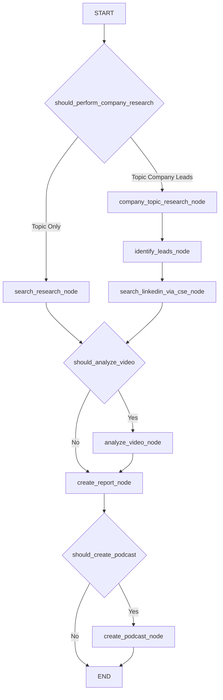

# Multi-Modal Researcher

This project is a versatile research and podcast generation workflow using LangGraph and Google's Gemini models. It now supports two main research approaches:
1.  **Topic-Only Research**: Performs web research on a given topic, optionally analyzes a YouTube video, synthesizes insights into a report, and can generate a podcast.
2.  **Topic, Company, and Leads Research**: Extends topic research to a specific company context, identifies key personnel (leads) within that company using both Gemini's advanced capabilities (including identifying potential buyers) and targeted Google Custom Search for LinkedIn profiles, then generates a comprehensive report and optional podcast.

The system leverages several of Gemini's native capabilities:

-  [Video understanding and native YouTube tool](https://developers.googleblog.com/en/gemini-2-5-video-understanding/): Integrated processing of YouTube videos
-  [Google search tool](https://developers.googleblog.com/en/gemini-2-5-thinking-model-updates/): Native Google Search tool integration with real-time web results
-  [Multi-speaker text-to-speech](https://ai.google.dev/gemini-api/docs/speech-generation): Generate natural conversations with distinct speaker voices


## Quick Start

### Prerequisites

- Python 3.11+
- [uv](https://docs.astral.sh/uv/) package manager
- Google Gemini API key


## Architecture

The system implements a LangGraph workflow with the following nodes:

The system implements a LangGraph workflow with conditional paths based on `research_approach`.

**Core Nodes:**
1.  **`search_research_node`**: (Topic Only path) Performs general web research on the topic.
2.  **`company_topic_research_node`**: (Topic Company Leads path) Researches the topic in the context of the specified company and gathers general company information.
3.  **`identify_leads_node`**: (Topic Company Leads path) Uses Gemini to identify detailed leads (name, title, department, relevance, named buyers) at the company.
4.  **`search_linkedin_via_cse_node`**: (Topic Company Leads path) Uses Google Custom Search Engine to find LinkedIn profiles matching the company and title areas.
5.  **`analyze_video_node`**: (Optional, both paths) Analyzes YouTube video content if a URL is provided.
6.  **`create_report_node`**: Synthesizes all gathered information (from topic research, company research, lead identification, CSE search, video analysis) into a comprehensive markdown report.
7.  **`create_podcast_node`**: (Optional, both paths) Generates a 2-speaker podcast discussion based on the synthesized research.

### Workflow Diagram (Simplified)



### Output

The system's output varies based on the research approach and optional steps:

-   **`report`**: A comprehensive markdown string.
    -   For "Topic Only": Contains synthesized information from web search and optional video analysis.
    -   For "Topic Company Leads": Contains synthesized information from company-specific topic research, general company info, detailed leads from Gemini (including named buyers), LinkedIn contacts from CSE, and optional video analysis.
-   **`identified_leads`**: (Optional, for "Topic Company Leads" approach) A list of dictionaries, where each dictionary details a lead found by Gemini (name, title, department, relevance, LinkedIn URL, and associated named buyers).
-   **`linkedin_cse_contacts`**: (Optional, for "Topic Company Leads" approach) A list of dictionaries, where each dictionary contains `title`, `link`, and `snippet` for LinkedIn profiles found via Google CSE.
-   **`podcast_script`**: (Optional) Text script of the generated podcast.
-   **`podcast_url`**: (Optional) URL to the generated podcast audio file (if GCS is configured) or local filename.

## Configuration

The system supports runtime configuration through the `Configuration` class:

### Model Settings
- `search_model`: Model for general web search and company/topic research (default: "gemini-2.5-flash")
- `synthesis_model`: Model for report synthesis (default: "gemini-2.5-flash")
- `video_model`: Model for video analysis (default: "gemini-2.5-flash")
- `tts_model`: Model for text-to-speech (default: "gemini-2.5-flash-preview-tts")
- `lead_identification_model`: Model for detailed lead identification via Gemini (default: "gemini-1.5-pro-latest")

### Temperature Settings
- `search_temperature`: For web search queries (default: 0.0)
- `synthesis_temperature`: For report synthesis (default: 0.3)
- `podcast_script_temperature`: For creative podcast dialogue (default: 0.4)
- `lead_identification_temperature`: For structured lead data extraction (default: 0.2)

### TTS Settings
- `mike_voice`: Voice for interviewer (default: "Kore")
- `sarah_voice`: Voice for expert (default: "Puck")
- Audio format settings for output quality

## Project Structure

```
├── src/agent/
│   ├── state.py           # State definitions (input/output schemas)
│   ├── configuration.py   # Runtime configuration class
│   ├── utils.py          # Utility functions (TTS, report generation)
│   └── graph.py          # LangGraph workflow definition
├── langgraph.json        # LangGraph deployment configuration
├── pyproject.toml        # Python package configuration
└── .env                  # Environment variables
```

## Key Components

### State Management (`src/agent/state.py`)

-   **`ResearchStateInput`**: Defines the input to the workflow. Key fields include:
    -   `topic: str` (Mandatory)
    -   `research_approach: Literal["Topic Only", "Topic Company Leads"]` (Mandatory)
    -   `company_name: Optional[str]`
    -   `title_areas: Optional[List[str]]`
    -   `video_url: Optional[str]`
    -   `create_podcast: bool`
-   **`ResearchStateOutput`**: Defines the final output. Key fields include:
    -   `report: Optional[str]`
    -   `identified_leads: Optional[List[Dict]]` (Detailed leads from Gemini)
    -   `linkedin_cse_contacts: Optional[List[Dict]]` (Contacts from CSE LinkedIn search)
    -   `podcast_script: Optional[str]`
    -   `podcast_url: Optional[str]`
-   **`ResearchState`**: The complete internal state of the graph, including all inputs, intermediate results (e.g., `search_text`, `company_specific_topic_research_text`, `identified_leads_data`), and final outputs.

### Utility Functions (`src/agent/utils.py`)

-   **`display_gemini_response()`**: Processes and displays Gemini responses, including grounding metadata.
-   **`create_podcast_discussion()`**: Generates a scripted podcast dialogue and TTS audio.
-   **`create_research_report()`**: Synthesizes information from various research steps (topic, company, leads, video) into a comprehensive markdown report. Handles different content based on `research_approach`.
-   **`generate_company_topic_research_prompt()`**: Creates the prompt for researching a topic in relation to a specific company.
-   **`generate_lead_identification_prompt()`**: Creates the prompt for Gemini to identify detailed leads, including departments and named buyers.
-   **`parse_leads_from_gemini_response()`**: Parses structured JSON output from Gemini for lead data.
-   **`build_linkedin_cse_query()`**: Constructs a Google Custom Search query string for finding LinkedIn profiles.
-   **`fetch_linkedin_contacts_via_cse()`**: Executes a Google Custom Search API call and parses the results for LinkedIn contacts.
-   **`wave_file()`**: Saves audio data to WAV format.

## Deployment

The application is configured for deployment on:

- **Local Development**: Using LangGraph CLI with in-memory storage
- **LangGraph Platform**: Production deployment with persistent storage
- **Self-Hosted**: Using Docker containers

## Dependencies

Core dependencies managed via `pyproject.toml`:

- `langgraph>=0.2.6` - Workflow orchestration
- `google-genai` - Gemini API client
- `langchain>=0.3.19` - LangChain integrations
- `rich` - Enhanced terminal output
- `python-dotenv` - Environment management
